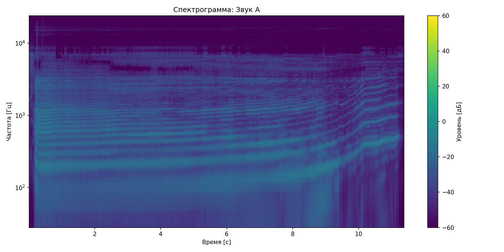
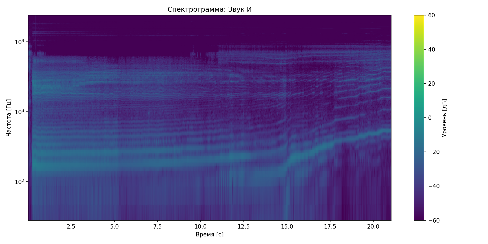
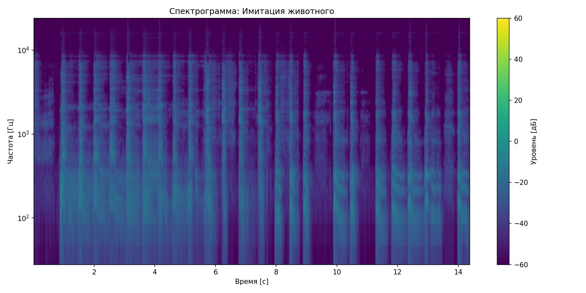

# Лабораторная работа №10: Обработка голоса

## Результаты анализа

### Звук А
- Длительность: 11.40 с
- Частотный диапазон: 0.0 - 1171.9 Гц
- Основная частота: 187.5 Гц
- Топ-3 форманты:
  1. 187.5 Гц
  2. 421.9 Гц
  3. 1171.9 Гц

### Звук И
- Длительность: 21.06 с
- Частотный диапазон: 140.5 - 3703.8 Гц
- Основная частота: 187.5 Гц
- Топ-3 форманты:
  1. 187.5 Гц
  2. 2343.8 Гц
  3. 1875.0 Гц

### Имитация животного
- Длительность: 14.40 с
- Частотный диапазон: 93.8 - 4781.2 Гц
- Основная частота: 140.6 Гц
- Топ-3 форманты:
  1. 328.1 Гц
  2. 609.4 Гц
  3. 1968.8 Гц

## Выводы
1. Разные звуки имеют характерные формантные структуры
2. Основная частота соответствует высоте голоса
3. Спектрограммы показывают распределение энергии по частотам
