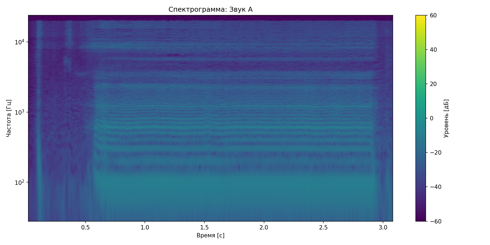
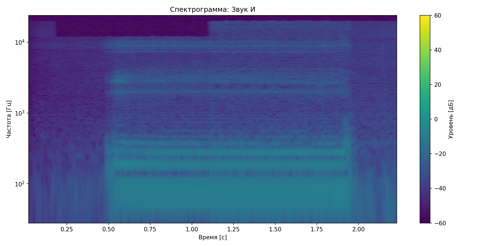
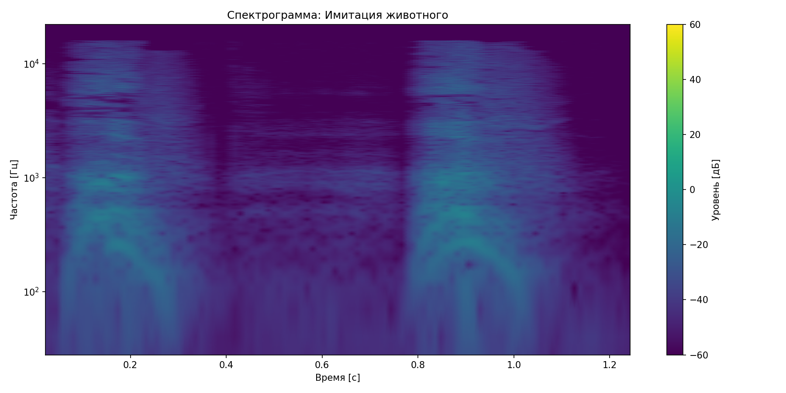

# Лабораторная работа №10: Обработка голоса

## Результаты анализа

### Звук А
- Длительность: 3.11 с
- Частотный диапазон: 93.8 - 1218.8 Гц
- Основная частота: 101.3 Гц
- Топ-3 форманты:
  1. 3955.1 Гц
  2. 3424.6 Гц
  3. 2284.5 Гц

### Звук И
- Длительность: 2.25 с
- Частотный диапазон: 93.8 - 93.8 Гц
- Основная частота: 93.0 Гц
- Топ-3 форманты:
  1. 4721.1 Гц
  2. 3629.5 Гц
  3. 2935.4 Гц

### Имитация животного
- Длительность: 1.27 с
- Частотный диапазон: 473.7 - 904.4 Гц
- Основная частота: 126.4 Гц
- Топ-3 форманты:
  1. 4377.9 Гц
  2. 3010.9 Гц
  3. 2379.0 Гц

## Выводы
1. Разные звуки имеют характерные формантные структуры
2. Основная частота соответствует высоте голоса
3. Спектрограммы показывают распределение энергии по частотам
