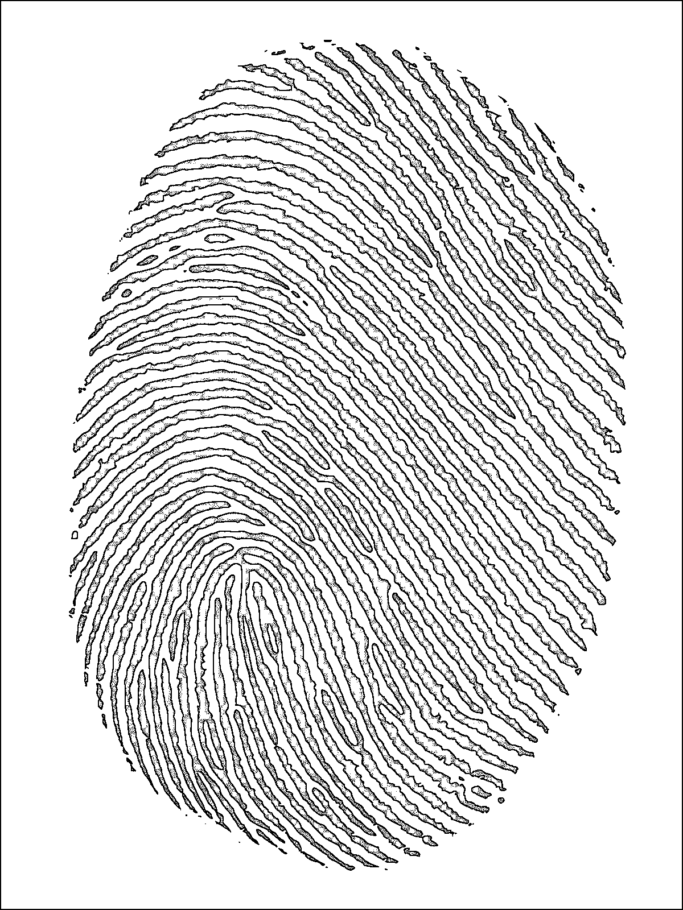

# Лабораторная работа №2: Обесцвечивание и бинаризация растровых изображений

## Задание 1: Приведение полноцветного изображения к полутоновому
Исходные изображения были преобразованы в полутоновые с использованием взвешенного усреднения каналов RGB.

## Задание 2: Адаптивная бинаризация Саувола
Полутоновые изображения были бинаризованы с использованием адаптивного алгоритма Саувола (окно 5x5).

### Contour_map

#### Исходное изображение

#### Полутоновое изображение

#### Бинаризованное изображение

### Xray

#### Исходное изображение

#### Полутоновое изображение

#### Бинаризованное изображение

### Cartoon_screenshot

#### Исходное изображение

#### Полутоновое изображение

#### Бинаризованное изображение

### Photo

#### Исходное изображение

#### Полутоновое изображение

#### Бинаризованное изображение

### Fingerprint

#### Исходное изображение

#### Полутоновое изображение

#### Бинаризованное изображение

### Text_page

#### Исходное изображение

#### Полутоновое изображение

#### Бинаризованное изображение

## Выводы
1. Преобразование в полутоновое изображение выполнено успешно для всех изображений. Яркость каждого пикселя была рассчитана как взвешенная сумма каналов RGB.
2. Адаптивная бинаризация Саувола позволила эффективно разделить изображения на черно-белые области с учетом локальных особенностей яркости.
3. Результаты работы алгоритмов сохранены в соответствующих файлах.
