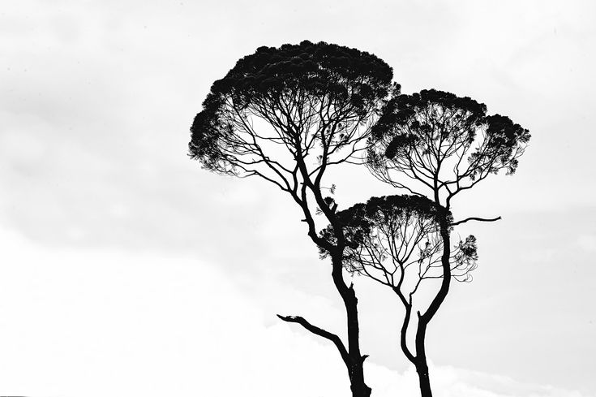
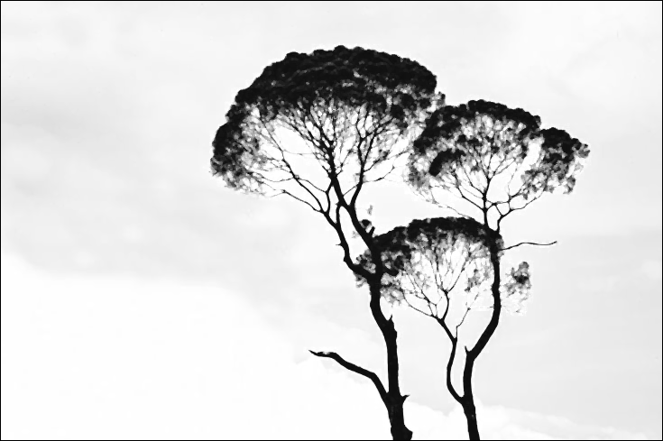
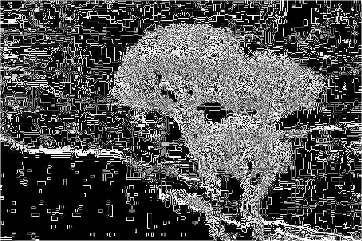
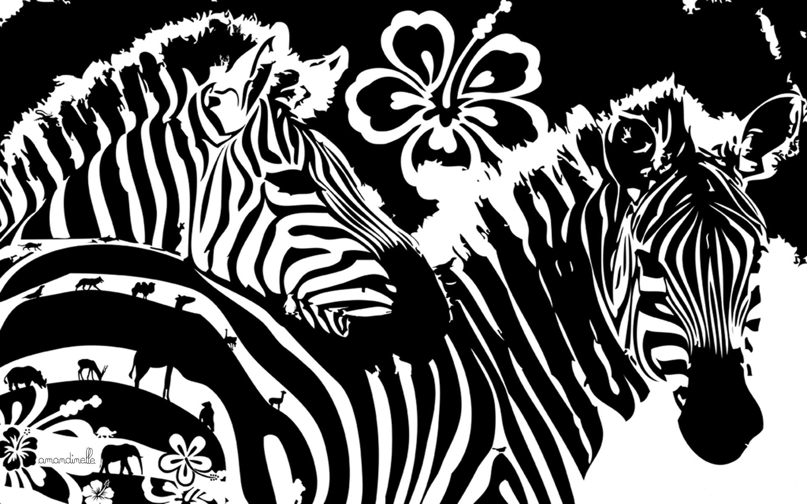
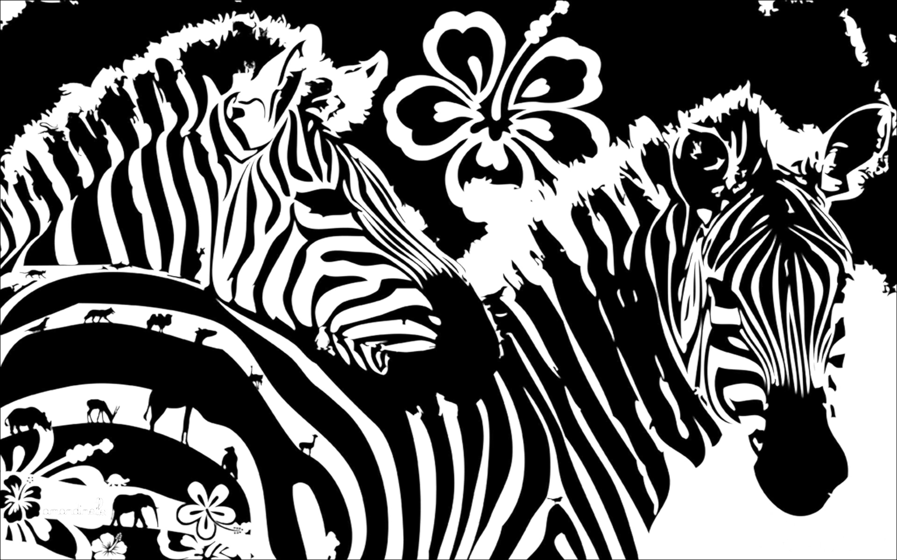
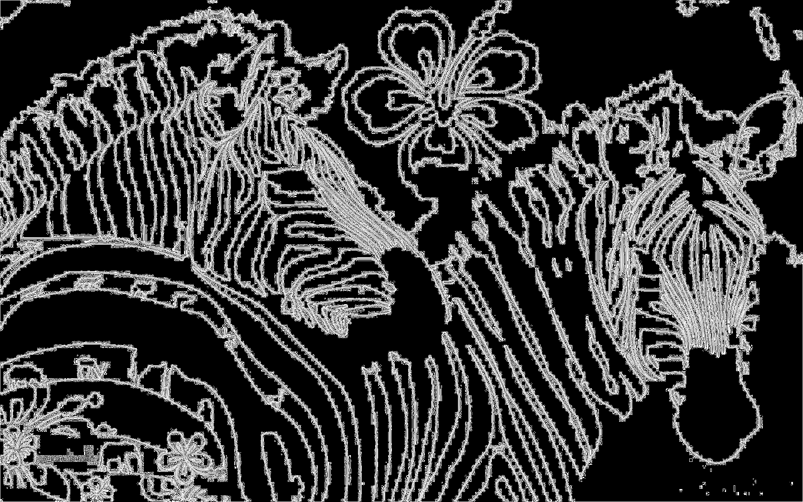
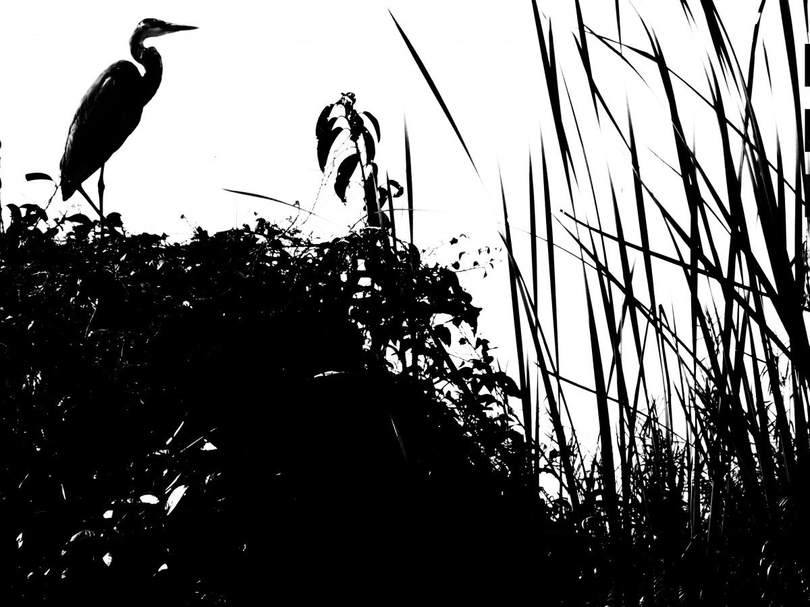
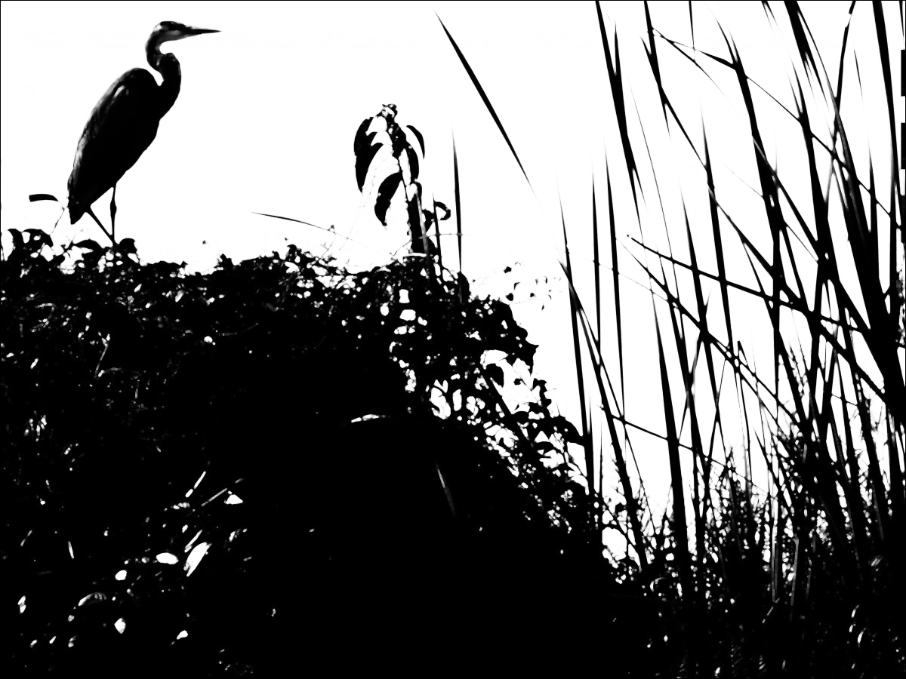
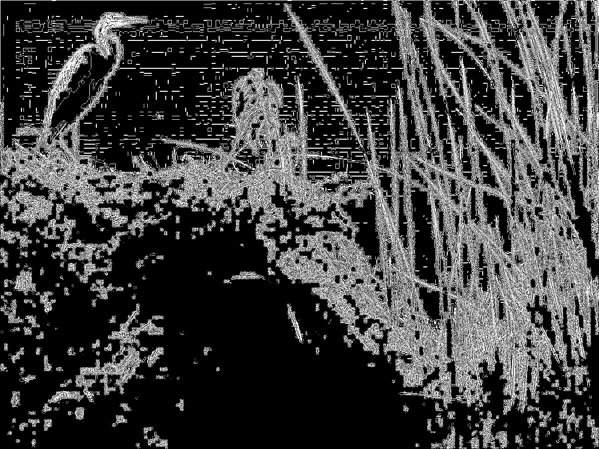

# Лабораторная работа №3: Фильтрация изображений и морфологические операции

## Задание 1: Ранговый фильтр
К каждому изображению был применен ранговый фильтр с окном 3x3 и рангом 7/9.

## Задание 2: Разностное изображение
Для каждого изображения было вычислено разностное изображение (модуль разности между исходным и отфильтрованным изображением).

### First_image

#### Исходное изображение

#### Отфильтрованное изображение

#### Разностное изображение

### Second_image

#### Исходное изображение

#### Отфильтрованное изображение

#### Разностное изображение

### Third_image

#### Исходное изображение

#### Отфильтрованное изображение

#### Разностное изображение

## Выводы
1. Ранговый фильтр успешно применен ко всем изображениям. Он заменил значения пикселей на значения, соответствующие рангу 7/9 в окрестности 3x3.
2. Разностное изображение показывает, какие пиксели были изменены фильтром.
3. Результаты работы сохранены в соответствующих файлах.
