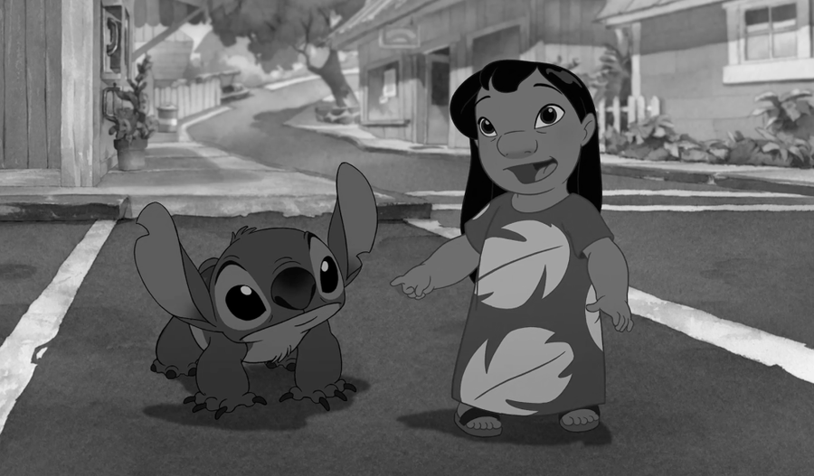
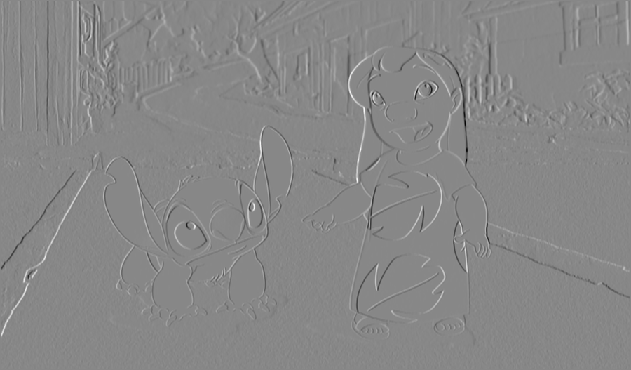
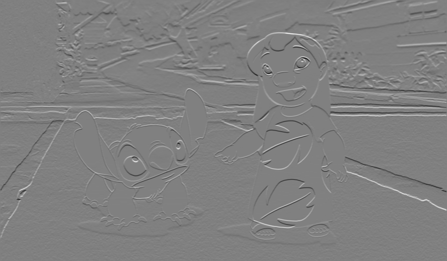
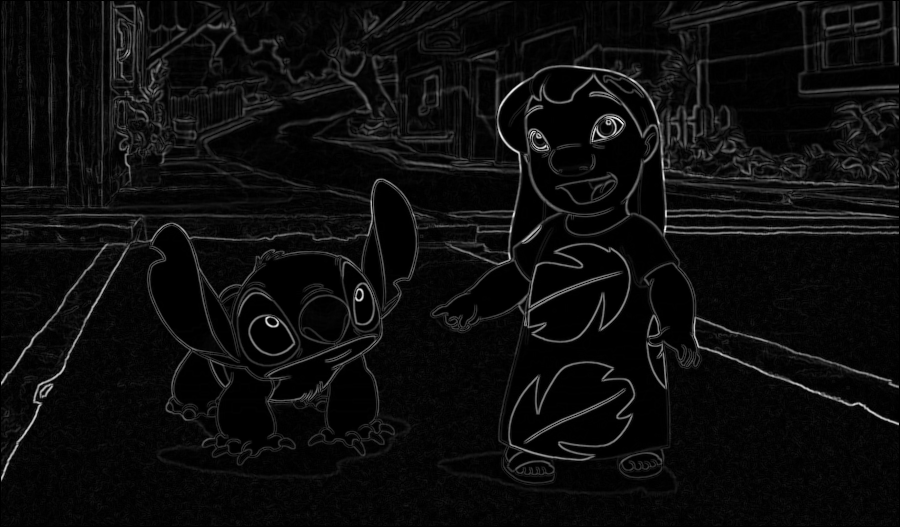
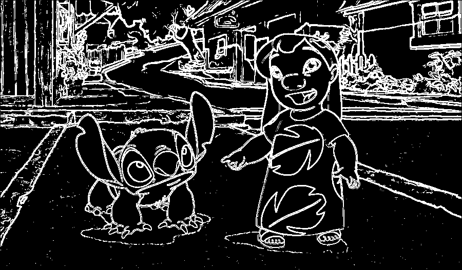

# Лабораторная работа №4: Выделение контуров на изображении

## Задание: Оператор Прюитта
К изображению был применен оператор Прюитта для выделения контуров.

### Исходное цветное изображение

### Полутоновое изображение

### Градиентная матрица Gx

### Градиентная матрица Gy

### Градиентная матрица G

### Бинаризованная градиентная матрица G

## Выводы
1. Оператор Прюитта успешно применен для выделения контуров на изображении.
2. Градиентные матрицы Gx, Gy и G были нормализованы к диапазону [0, 255].
3. Бинаризация градиентной матрицы G позволила выделить четкие контуры.
