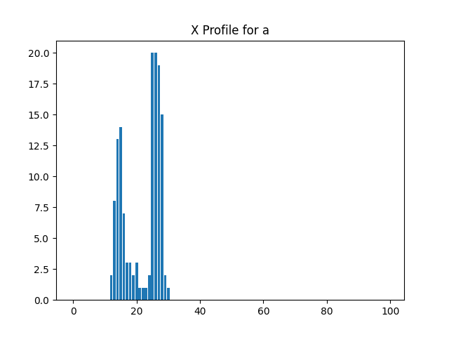
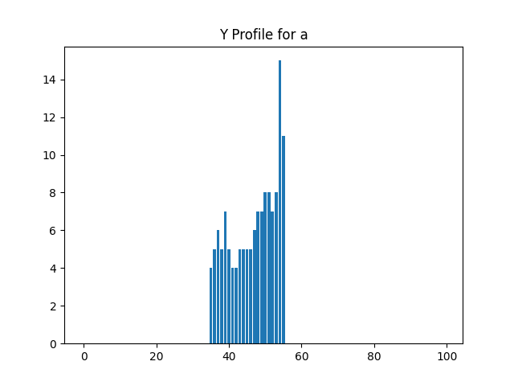

# Лабораторная работа №5. Выделение признаков символов

## Задание 1: Генерация эталонных изображений символов

Изображения символов английского алфавита (строчные курсивные) были сгенерированы с использованием шрифта Times New Roman, кегль 52. Каждый символ сохранен в отдельный файл в формате PNG.

Пример изображений:

  

## Задание 2: Расчет признаков

Для каждого изображения символа были рассчитаны следующие признаки:

- Координаты центра тяжести (x_c, y_c)
- Осевые моменты инерции (I_x, I_y)

Результаты сохранены в файл `features.csv`.

## Задание 3: Профили X и Y

Для каждого символа построены профили X и Y. Примеры профилей:

### Профиль X для символа 'a'

### Профиль Y для символа 'a'

## Заключение

В ходе выполнения лабораторной работы были сгенерированы изображения символов, рассчитаны их признаки и построены профили. Все результаты сохранены в соответствующие файлы.
