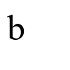
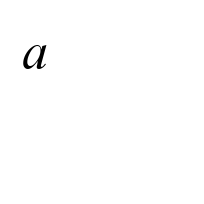
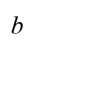
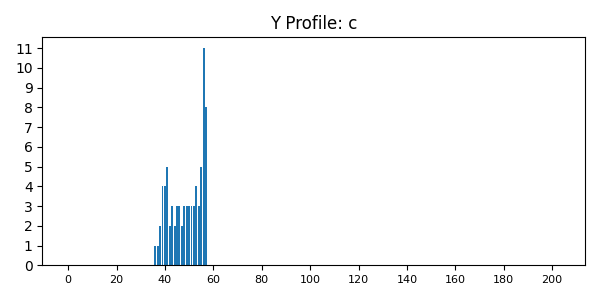
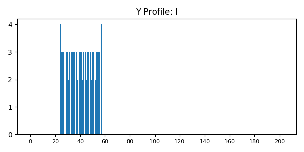
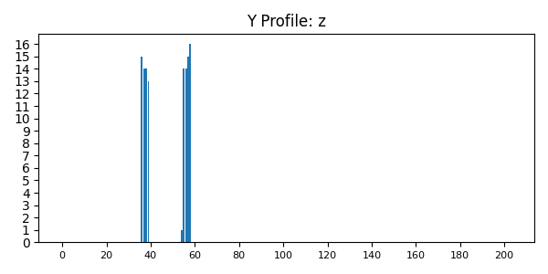

# Лабораторная работа №5. Выделение признаков символов

## Задание 1: Генерация эталонных изображений символов

Изображения символов английского алфавита (строчные курсивные) были сгенерированы с использованием шрифта Times New Roman, кегль 52. Каждый символ сохранен в отдельный файл в формате PNG.

Пример изображений:

  

## Задание 2: Расчет признаков

Для каждого изображения символа были рассчитаны следующие признаки:

- Координаты центра тяжести (x_c, y_c)
- Осевые моменты инерции (I_x, I_y)

Результаты сохранены в файл `features.csv`.

## Задание 3: Профили X и Y

Для каждого символа построены профили X и Y. Примеры профилей:

### Символ: а

#### Изображение символа

#### Профиль X

#### Профиль Y

### Символ: b

#### Изображение символа

#### Профиль X

#### Профиль Y

### Символ: c

#### Изображение символа

#### Профиль X

#### Профиль Y

### Символ: d

#### Изображение символа

#### Профиль X

#### Профиль Y

### Символ: e

#### Изображение символа

#### Профиль X

#### Профиль Y

### Символ: f

#### Изображение символа

#### Профиль X

#### Профиль Y

### Символ: g

#### Изображение символа

#### Профиль X

#### Профиль Y

### Символ: h

#### Изображение символа

#### Профиль X

#### Профиль Y

### Символ: i

#### Изображение символа

#### Профиль X

#### Профиль Y

### Символ: j

#### Изображение символа

#### Профиль X

#### Профиль Y

### Символ: k

#### Изображение символа

#### Профиль X

#### Профиль Y

### Символ: l

#### Изображение символа

#### Профиль X

#### Профиль Y

### Символ: m

#### Изображение символа

#### Профиль X

#### Профиль Y

### Символ: n

#### Изображение символа

#### Профиль X

#### Профиль Y

### Символ: o

#### Изображение символа

#### Профиль X

#### Профиль Y

### Символ: p

#### Изображение символа

#### Профиль X

#### Профиль Y

### Символ: q

#### Изображение символа

#### Профиль X

#### Профиль Y

### Символ: r

#### Изображение символа

#### Профиль X

#### Профиль Y

### Символ: s

#### Изображение символа

#### Профиль X

#### Профиль Y

### Символ: t

#### Изображение символа

#### Профиль X

#### Профиль Y

### Символ: u

#### Изображение символа

#### Профиль X

#### Профиль Y

### Символ: v

#### Изображение символа

#### Профиль X

#### Профиль Y

### Символ: w

#### Изображение символа

#### Профиль X

#### Профиль Y

### Символ: x

#### Изображение символа

#### Профиль X

#### Профиль Y

### Символ: y

#### Изображение символа

#### Профиль X

#### Профиль Y

### Символ: z

#### Изображение символа

#### Профиль X

#### Профиль Y

## Заключение

В ходе выполнения лабораторной работы были сгенерированы изображения символов, рассчитаны их признаки и построены профили. Все результаты сохранены в соответствующие файлы.
