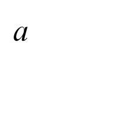
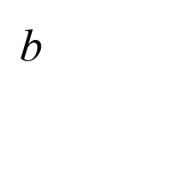
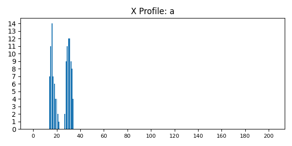
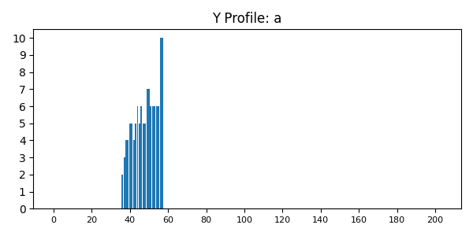

# Лабораторная работа №5. Выделение признаков символов

## 1. Генерация изображений
Примеры символов с рамкой:
  

## 2. Рассчитанные признаки
Полный список признаков сохранен в [features.csv](features.csv)

## 3. Примеры профилей
 
