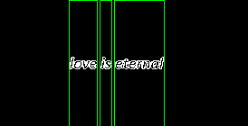
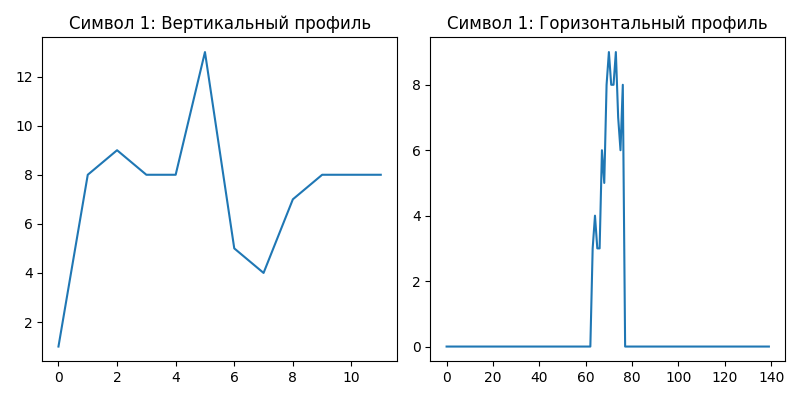
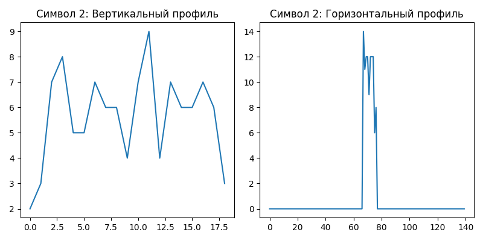
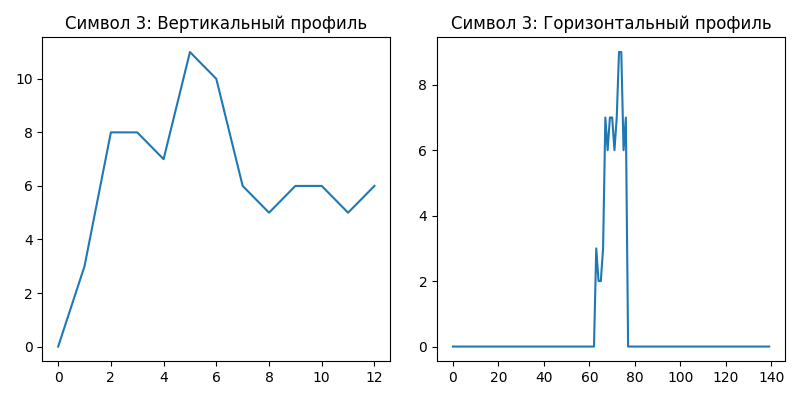
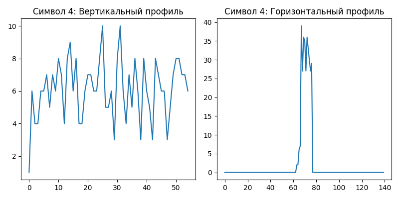

# Лабораторная работа №6. Сегментация текста

## 1. Исходное изображение

## 2. Горизонтальный и вертикальный профили

## 3. Сегментация символов

## 4. Профили символов
### Символ 1

### Символ 2

### Символ 3

### Символ 4

## Выводы
- Алгоритм успешно сегментировал символы на основе вертикального профиля.
- Для курсива потребовалось дополнительное выравнивание.
- Порог `threshold=2` позволил игнорировать шумы.
