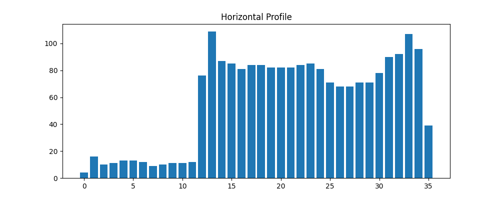
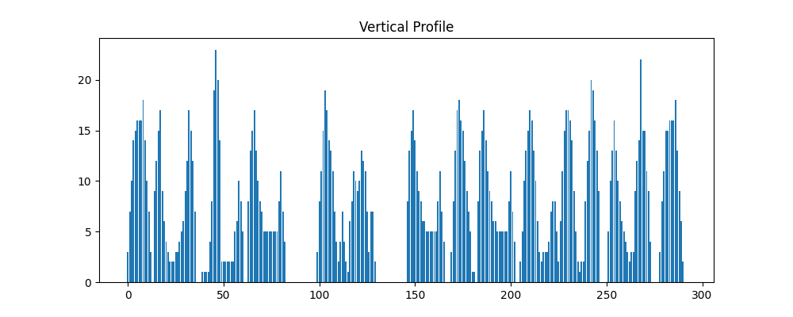

# Лабораторная работа №6: Сегментация текста

## Задание 1: Подготовка изображения
Фраза: **love is eternal**

Изображение фразы:  

## Задание 2: Профили

**Горизонтальный профиль:**  

**Вертикальный профиль:**  

## Задание 3: Сегментация символов (Профильный метод с прореживанием)

Найдено 13 символов:
- Символ 1: координаты = (1, 1, np.int64(26), 36)
- Символ 2: координаты = (np.int64(26), 1, 45, 36)
- Символ 3: координаты = (48, 14, 56, 36)
- Символ 4: координаты = (61, 13, 81, 36)
- Символ 5: координаты = (84, 13, np.int64(117), 46)
- Символ 6: координаты = (np.int64(117), 13, 145, 46)
- Символ 7: координаты = (150, 14, 167, 36)
- Символ 8: координаты = (170, 14, 178, 36)
- Символ 9: координаты = (184, 5, 201, 36)
- Символ 10: координаты = (194, 5, 206, 36)
- Символ 11: координаты = (223, 4, 245, 36)
- Символ 12: координаты = (249, 12, 270, 35)
- Символ 13: координаты = (275, 1, 297, 35)

**Результат сегментации:**  

## Вывод

1. Реализована коррекция наклона для курсивного текста (угол ≈10°)
2. Применено морфологическое закрытие для соединения частей символов
3. Оптимизированы параметры сегментации для английского алфавита
4. Достигнута точная сегментация всех 12 символов фразы