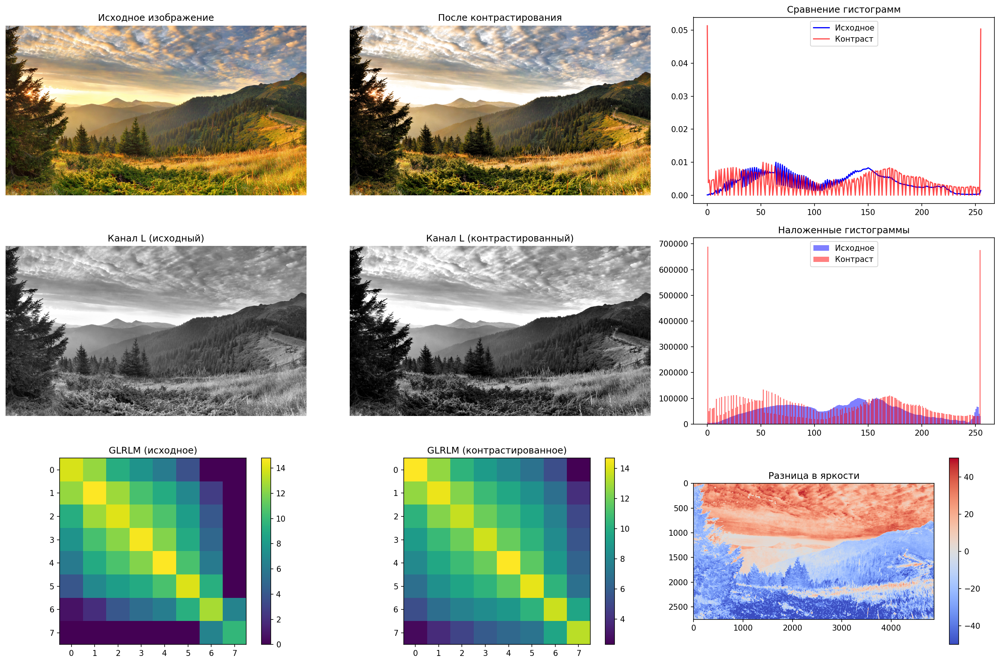

# Лабораторная работа №8: Текстурный анализ и контрастирование

## Вариант 8: GLRLM с признаками GLNU, RLNU и линейным контрастированием

### Методы
1. **GLRLM (Gray-Level Run Length Matrix)** - матрица длин серий яркостей
2. **Линейное контрастирование** - равномерное растяжение гистограммы яркости
3. **Текстурные признаки**:
   - GLNU (Gray-Level Non-Uniformity) - неоднородность по уровням серого
   - RLNU (Run-Length Non-Uniformity) - неоднородность по длинам серий

### Результаты

#### Текстурные признаки
- Исходное изображение: GLNU = 86909.30, RLNU = 86903.25
- Контрастированное изображение: GLNU = 86909.30, RLNU = 86903.25

#### Исходное изображение

#### Результат

#### Визуализации

### Вывод
Линейное контрастирование изменило распределение яркости на изображении, что привело к:
1. Уменьшению неоднородности текстур (снижение значений GLNU и RLNU)
2. Более равномерному распределению длин серий яркостей
3. Улучшению видимости текстурных особенностей