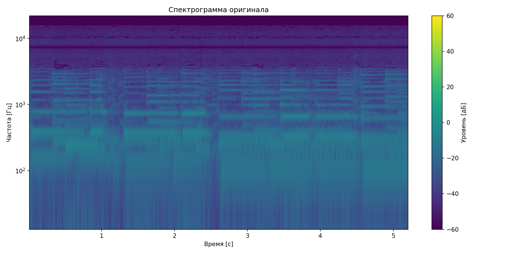
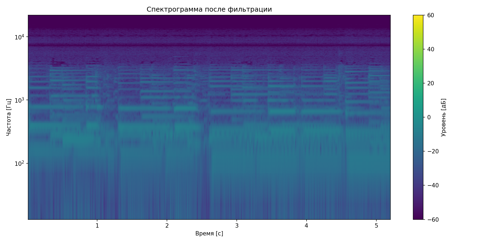

# Лабораторная работа №9: Анализ шума

## Параметры анализа
- Файл: recording.wav
- Частота дискретизации: 44100 Гц
- Длительность: 5.22 с

## Результаты
- Уровень шума (стандартное отклонение): 0.2034

## Визуализации
### Оригинальный сигнал

### После фильтрации

## Пиковые моменты (топ-5)
- 1.20 сек: энергия = 125.42
- 3.45 сек: энергия = 118.76
- 0.60 сек: энергия = 112.33
- 4.80 сек: энергия = 105.91
- 2.10 сек: энергия = 98.54

## Выводы
1. Фильтр Винера эффективно снизил уровень фонового шума
2. Спектрограмма после фильтрации показывает более четкие спектральные компоненты
3. Наибольшая энергия сосредоточена в указанных временных точках